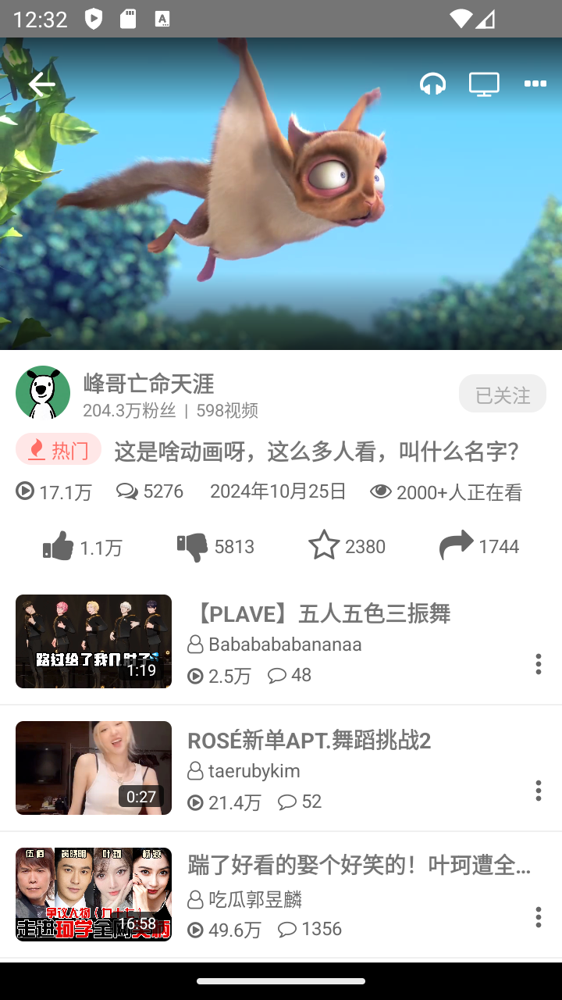

# 哔哩哔哩 React Native 项目

本项目是一个基于 **React Native** 开发的仿哔哩哔哩（Bilibili）的移动应用界面。项目旨在利用最新的流行 **React Native** 框架和组件，为用户提供逼真的体验。**此项目仅用于学习和交流，不可用于商业用途。**

<br><br>
<br><br>
<br><br>
<br>

## 功能点

- 基于 **React Native** (版本 0.75.3) 开发
- 实现了类似哔哩哔哩的用户界面设计
- 使用了现代的 **React Native** 框架和组件
- 持续进行功能改进和更新，提升用户体验
- 支持跨平台开发（iOS 和 Android）

## 页面及功能概述

### 1. **首页（HomeTab）**

**功能**：
- 推荐视频展示：展示各种推荐视频，用户可以滚动查看。
- 视频分类导航：支持按不同视频类型分类，提供便捷的视频浏览体验。
- 视频预览与播放：点击视频封面即可进入视频详情页面进行播放。

**特点**：
- 支持瀑布流式布局，分页加载更多视频，用户体验流畅。

### 2. **视频详情页（VideoDetailScreen）**

**功能**：
- 视频播放：支持全屏播放、播放/暂停、快进等功能。
- 视频详情：显示视频标题、上传者信息、播放量、点赞数等。
- 弹幕与评论：用户可以发送和查看弹幕，浏览和发布评论。
- 点赞、收藏与分享：用户可以进行视频互动操作。

**特点**：
- 支持全屏模式和竖屏模式切换，交互流畅。

### 3. **动态页（DynamicsScreen）**

**功能**：
- 动态发布：支持文字、图片、视频动态发布。
- 动态列表：展示用户及关注者发布的动态内容，支持点赞、评论。
- 动态互动：显示用户的点赞、评论通知。

### 4. **个人中心页（My）**

**功能**：
- 展示用户的个人信息：包括粉丝数、关注数、已发布视频等。
- 查看历史记录：用户可以查看自己观看、点赞过的视频。
- 账户设置：支持编辑个人信息、管理账户安全等。

### 5. **底部导航栏（TabNavigator）**

**功能**：
- 提供首页、动态、个人中心的快捷导航，方便用户快速切换。
- 动态高亮效果：用户当前所在页面的图标和文字高亮显示。

### 功能亮点

- **跨平台支持**：适用于 iOS 和 Android 平台，保证一致的用户体验。
- **用户交互**：提供点赞、评论、收藏、弹幕等互动功能。
- **定期更新**：项目会不断进行功能更新，跟进 React Native 的最新技术。

## 兼容性

- **React Native**：0.75.3 版本

## 安装指南

要开始使用该项目，请按照以下步骤操作：

1. 克隆项目仓库：

   ```bash
   git clone https://github.com/yourusername/bilibili-react-native.git
   cd bilibili-react-native
   ```

2. 安装项目依赖：

   ```bash
   npm i
   ```

## 运行应用

### iOS

要在 iOS 模拟器上运行该应用，请使用以下命令：

```bash
npm run ios
```

该命令将启动 iOS 模拟器并在上面运行应用。

### Android

要在 Android 模拟器或实际设备上运行该应用，请使用以下命令：

```bash
npm run android
```

在运行命令之前，请确保已连接 Android 模拟器或物理设备。

## Contributing

欢迎贡献代码！你可以为本项目点赞和 fork，我会持续进行更新以提高功能和性能。

## License

此项目仅供学习和教育目的使用，严禁用于商业用途。
